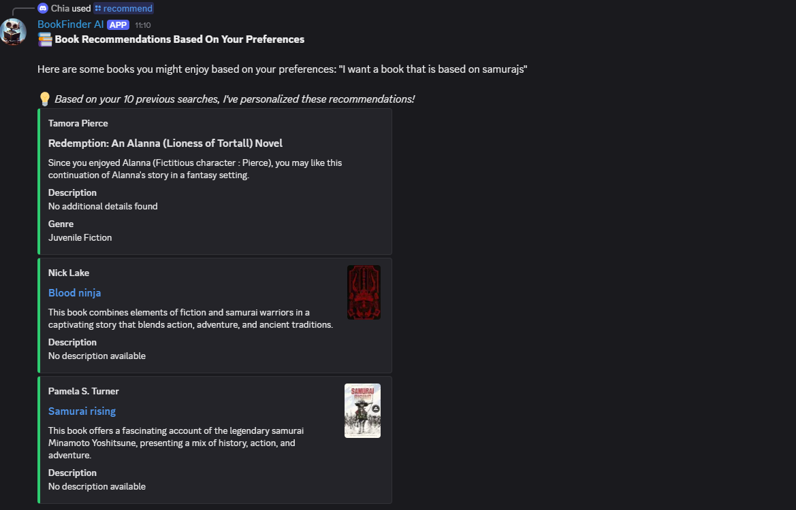
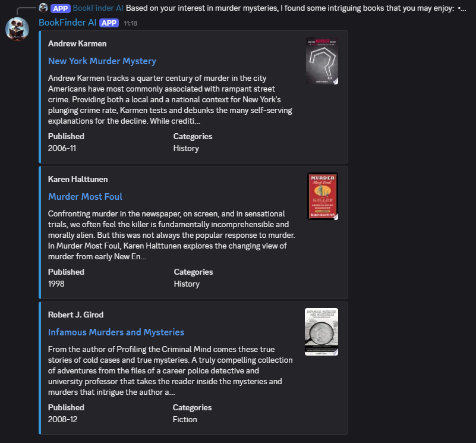
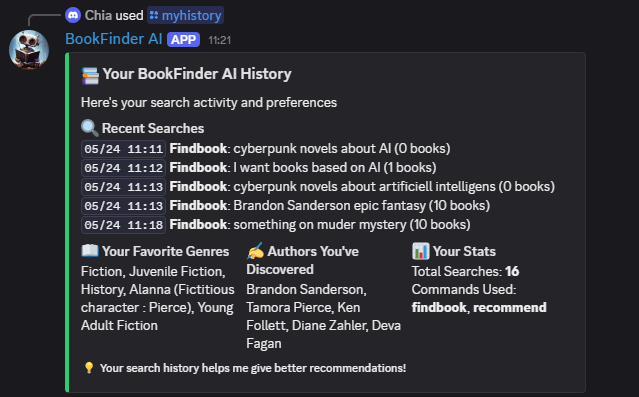

# 📚 BookFinder AI - Advanced Discord Bot with RAG System

[](https://python.org)
[](https://discordpy.readthedocs.io/)
[](https://openai.com)
[](LICENSE)

An intelligent Discord bot powered by **Retrieval-Augmented Generation (RAG)** that learns from user interactions to provide personalized book recommendations. Features advanced AI capabilities, user analytics, and privacy-compliant data management.

## ✨ Key Features

### 🤖 **AI-Powered Intelligence**
- **Natural Language Processing** with OpenAI GPT-3.5-turbo
- **Smart Query Understanding** - Describe books any way you want
- **Contextual Responses** - AI provides explanations with recommendations
- **Multi-API Integration** - Google Books API + Open Library fallback

### 🧠 **RAG System (Retrieval-Augmented Generation)**
- **User Interaction Logging** - Learns from every conversation
- **Personalized Recommendations** - AI adapts to your reading preferences
- **Preference Analytics** - Discovers your favorite genres and authors
- **Adaptive Learning** - Gets smarter with each interaction

### 📊 **Advanced Analytics**
- **Personal Search History** - View your book discovery journey
- **System-Wide Statistics** - Usage metrics and trends
- **User Behavior Analysis** - Genre preferences and reading patterns
- **Real-Time Data Processing** - Structured JSON logging

### 🔒 **Privacy & Compliance**
- **GDPR-Compliant** - Full user data control
- **Transparent Data Handling** - See exactly what's stored
- **Data Deletion Rights** - Clear your history anytime
- **Privacy-First Design** - Built with user rights in mind

## 🎯 Commands

| Command | Description | Example |
|---------|-------------|---------|
| `/findbook [query]` | AI-powered book search | `/findbook fantasy books with magic systems` |
| `/recommend [preferences]` | Personalized recommendations | `/recommend I love epic fantasy and sci-fi` |
| `/myhistory` | View your search history & analytics | `/myhistory` |
| `/analytics` | System statistics & RAG capabilities | `/analytics` |
| `/clearhistory` | GDPR-compliant data management | `/clearhistory` |
| `/bookhelp` | Comprehensive help guide | `/bookhelp` |

## 🚀 Technology Stack

### **Core Technologies**
- **Python 3.8+** - Modern async/await patterns
- **Discord.py 2.3+** - Advanced Discord integration
- **OpenAI API** - GPT-3.5-turbo for NLP
- **Asyncio** - High-performance async operations

### **APIs & Integrations**
- **Google Books API** - Primary book database
- **Open Library API** - Fallback & additional metadata
- **Discord Slash Commands** - Modern user interaction

### **AI & Data Science**
- **Natural Language Processing** - Query understanding
- **Retrieval-Augmented Generation** - Learning from interactions
- **User Behavior Analytics** - Preference modeling
- **JSON Data Processing** - Structured logging

## ⚙️ Installation & Setup

### **Prerequisites**
- Python 3.8 or higher
- Discord Bot Token ([Discord Developer Portal](https://discord.com/developers/applications))
- OpenAI API Key ([OpenAI Platform](https://platform.openai.com/api-keys))
- Google Books API Key ([Google Cloud Console](https://console.cloud.google.com/))

### **Quick Start**
```bash
# 1. Clone repository
git clone https://github.com/yourusername/bookfinder-ai-discord-bot.git
cd bookfinder-ai-discord-bot

# 2. Create virtual environment
python -m venv venv

# 3. Activate virtual environment
# Windows:
venv\Scripts\activate
# Linux/Mac:
source venv/bin/activate

# 4. Install dependencies
pip install -r requirements.txt

# 5. Configure environment variables
cp .env.example .env
# Edit .env with your API keys

# 6. Run the bot
python main.py
```

### **Environment Configuration**
Create a `.env` file with:
```env
DISCORD_TOKEN=your_discord_bot_token
OPENAI_API_KEY=your_openai_api_key
GOOGLE_BOOKS_API_KEY=your_google_books_key
BOT_PREFIX=!
```

## 📈 RAG System Overview

The **Retrieval-Augmented Generation** system is the core innovation of this bot:

### **Data Collection**
- Every user interaction is logged with structured metadata
- Queries, responses, and book results are preserved
- User preferences are extracted and analyzed

### **Learning & Adaptation**
- AI responses improve based on user history
- Personalized recommendations using preference patterns
- Context-aware responses that reference past interactions

### **Privacy-First Approach**
- Users can view all their stored data
- Complete data deletion capabilities
- Transparent about what information is collected

## 🎭 Usage Examples

### **Natural Language Queries**
```
/findbook fantasy books with complex magic systems like Brandon Sanderson
/findbook mystery novels set in Victorian London
/findbook something similar to The Martian but fantasy
```

### **Personalized Recommendations**
```
/recommend I enjoyed The Name of the Wind and Dune
/recommend more books like what I've searched for before
/recommend dark fantasy with strong character development
```

### **Analytics & History**
```
/myhistory          # View your reading journey
/analytics          # System-wide statistics
/clearhistory       # GDPR data deletion
```

## 🏆 Project Highlights

- **🧠 Advanced AI Concepts** - RAG implementation demonstrates cutting-edge techniques
- **📊 Data Science Integration** - User analytics and behavioral modeling
- **🔒 Privacy Engineering** - GDPR compliance built from the ground up
- **🏗️ Production-Ready Architecture** - Scalable, maintainable codebase
- **📱 Modern UX Design** - Rich Discord embeds and intuitive commands

## 📸 Screenshots

### 🧠 **RAG System in Action - Personalized Recommendations**

*The bot learns from user history and provides personalized samurai book recommendations based on 10 previous searches*

### 🔍 **AI-Powered Book Search with Rich Embeds**  

*Natural language processing understands "murder mysteries" and provides contextual, intelligent responses*

### 📚 **Professional Book Display with Metadata**

*Rich Discord embeds showcase book covers, descriptions, publication dates, and categories*

### 📊 **User Analytics Dashboard - RAG Data Visualization**

*Complete user journey tracking: 16 total searches, favorite genres analysis, discovered authors, and timestamped search history*

> **🎯 Key Features Demonstrated:**
> - **RAG Learning**: "Based on your 10 previous searches, I've personalized these recommendations!"
> - **Smart AI Responses**: Contextual explanations with book suggestions  
> - **User Analytics**: Genre preferences, author discovery, and search statistics
> - **Professional UX**: Beautiful embeds with book covers and structured data

## 🤝 Contributing

This project was developed as part of an AI/ML course to demonstrate advanced concepts in:
- Retrieval-Augmented Generation (RAG)
- Natural Language Processing
- User Experience Design
- Privacy-Compliant AI Systems

## 🏗️ Project Structure

```
bookfinder-ai-discord-bot/
├── src/                          # Source code directory
│   ├── cogs/                     # Discord command modules
│   │   ├── analytics.py          # User analytics & system stats commands
│   │   ├── bookhelp.py           # Help and guidance commands
│   │   ├── findbook.py           # AI-powered book search command
│   │   ├── recommend.py          # RAG personalized recommendations
│   │   └── __init__.py
│   ├── services/                 # Business logic services
│   │   ├── book_service.py       # Google Books & Open Library integration
│   │   ├── openai_service.py     # OpenAI GPT-3.5-turbo integration
│   │   ├── rag_service.py        # RAG system & user interaction logging
│   │   └── __init__.py
│   ├── utils/                    # Utility functions
│   │   └── __init__.py
│   ├── bot.py                    # Main bot application
│   ├── config.py                 # Configuration management
│   └── __init__.py
├── screenshots/                  # Project demonstration images
│   ├── ai-book-search.png
│   ├── professional-book-display.png
│   ├── rag-personalized-recommendations.png
│   └── user-analytics-dashboard.png
├── main.py                       # Application entry point
├── requirements.txt              # Python dependencies
├── user_interactions.log         # RAG system data storage
├── LICENSE                       # MIT License file
├── README.md                     # Project documentation
└── .gitignore                    # Git ignore patterns
```

### **🎯 Architecture Overview**

- **`src/cogs/`** - Modular Discord commands using discord.py's Cog system
- **`src/services/`** - Clean separation of business logic from presentation
- **`src/bot.py`** - Core Discord bot setup and event handling
- **`src/config.py`** - Centralized configuration and environment management
- **RAG System** - User interaction logging and personalized recommendations
- **Multi-API Design** - Primary/fallback pattern for reliability

## 📝 License & Open Source

**This project is proudly open source!** 🌟

## 🎓 Academic Development

**This project was developed as part of an AI/ML course** to demonstrate advanced concepts and practical applications in artificial intelligence.

